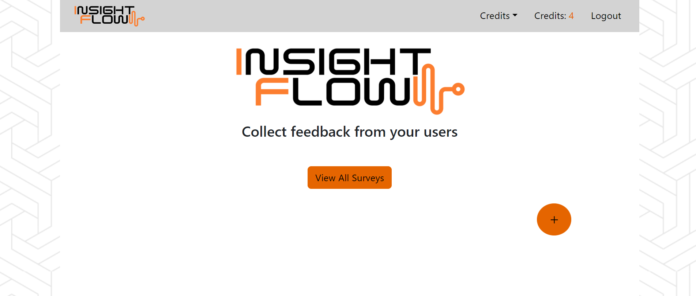

<p align="center">

</p>

# InsightFlow

InsightFlow is a web application built with Node.js and React, designed to help companies send emails to users requesting feedback on their experience using the company's app.

## Features

- **Authentication**: Supports both Google OAuth and username/password authentication, providing secure login options for users.
- **Email Functionality**: Create and send feedback request emails, and track client responses.
- **Stripe Payment Integration**: Accept and process credit card payments.


## Installation

1. **Clone the Repository**

   ```bash
   git clone https://github.com/ShahafErez/InsightFlow.git

2. **Install Dependencies**
   ```bash
   cd server
    npm install

   cd client
   npm install

3. **Set Up Configuration**
   Create a `.dev` file in the `server/config` directory with the following configuration keys:

   ```javascript
   module.exports = {
     googleClientID: process.env.GOOGLE_CLIENT_ID,
     googleClientSecret: process.env.GOOGLE_CLIENT_SECRET,
     mongoURI: process.env.MONGO_URL,
     cookieKey: process.env.COOKIE_KEY,
     stripePublishableKey: process.env.STRIPE_PUBLISHABLE_KEY,
     stripeSecretKey: process.env.STRIPE_SECRET_KEY,
     sendGridKey: process.env.SEND_GRID_KEY,
     redirectDomain: process.env.REDIRECT_DOMAIN,
   };
   ```


## Running the Application
  ```bash
  cd server
  npm run dev
```

## License
This project is licensed under the [MIT License](LICENSE).
